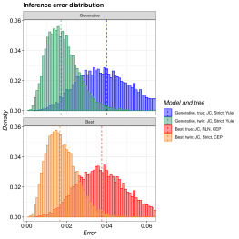

# pirouette

Branch   |[GitHub Actions](https://github.com/richelbilderbeek/pirouette/actions)                                     |                                                                            |                                                                                                                     |
---------|------------------------------------------------------------------------------------------------------------|-----------------------------------------------------------------------------------------------------------------------------------------|------------------------------------------------------------------------------------------------------------------------------------------------------------------------------------|--------------------------------------------------------------------------------------------------------------------------------------------------------------------
`master` | |  |    |
`develop`|| |  |

`pirouette` is an R package that estimates the error BEAST2 makes from a given 
phylogeny. This phylogeny can be created using any (non-BEAST) speciation model,
for example the Protracted Birth-Death or Multiple-Birth-Death models.

 * [Installation](doc/install.md).
 * [Examples](https://github.com/richelbilderbeek/pirouette_examples)
 * [Interpretation](doc/interpretation.md).
 * [Academic article](https://github.com/richelbilderbeek/pirouette_article)

## Common abbreviations

 * `nsm`: Nucleotide Substitution Model
 * `tral`: TRin ALignment
 * `twal`: TWin ALignment

## [FAQ](doc/faq.md)

See the [FAQ](doc/faq.md).

## There is a feature I miss

See [CONTRIBUTING](CONTRIBUTING.md), at `Submitting use cases`

## I want to collaborate

See [CONTRIBUTING](CONTRIBUTING.md), at 'Submitting code'

## I think I have found a bug

See [CONTRIBUTING](CONTRIBUTING.md), at 'Submitting bugs' 

## There's something else I want to say

Sure, just add an Issue. Or send an email.

## Package dependencies

### `master` branches

Package                                                |                                                                       |
-------------------------------------------------------|------------------------------------------------------------------------------------------------------------------------------------|-----------------------------------------------------------------------------------------------------------------------------------------------------------------
[beautier](https://github.com/ropensci/beautier)       |               |
[beastier](https://github.com/ropensci/beastier)       |               |
[mauricer](https://github.com/ropensci/mauricer)       |               |
[mcbette](https://github.com/ropensci/mcbette) | |
[tracerer](https://github.com/ropensci/tracerer)       |               |

### `develop` branches

Package                                                |                                                                       |
-------------------------------------------------------|------------------------------------------------------------------------------------------------------------------------------------|-----------------------------------------------------------------------------------------------------------------------------------------------------------------
[beautier](https://github.com/ropensci/beautier)       |               |
[beastier](https://github.com/ropensci/beastier)       |               |
[mauricer](https://github.com/ropensci/mauricer)       |               |
[mcbette](https://github.com/ropensci/mcbette) | |
[tracerer](https://github.com/ropensci/tracerer)       |               |

### Windows

Package                                                                       | Status
------------------------------------------------------------------------------|------------------------------------------------------------------------------------------------------------------------------------------------------------------------------------------
[babette_on_windows](https://github.com/richelbilderbeek/babette_on_windows)  |
[beastier_on_windows](https://github.com/richelbilderbeek/beastier_on_windows)|
[beautier_on_windows](https://github.com/richelbilderbeek/beautier_on_windows)|
[mauricer_on_windows](https://github.com/richelbilderbeek/mauricer_on_windows)|
[tracerer_on_windows](https://github.com/richelbilderbeek/tracerer_on_windows)|

## External links

 * [BEAST2 GitHub](https://github.com/CompEvol/beast2)

## References

 *  Bilderbeek, RJC, Laudanno, G, Etienne, RS. Quantifying the impact of an inference model in Bayesian phylogenetics. Methods Ecol Evol. 2020; 00: 1– 8. https://doi.org/10.1111/2041-210X.13514

