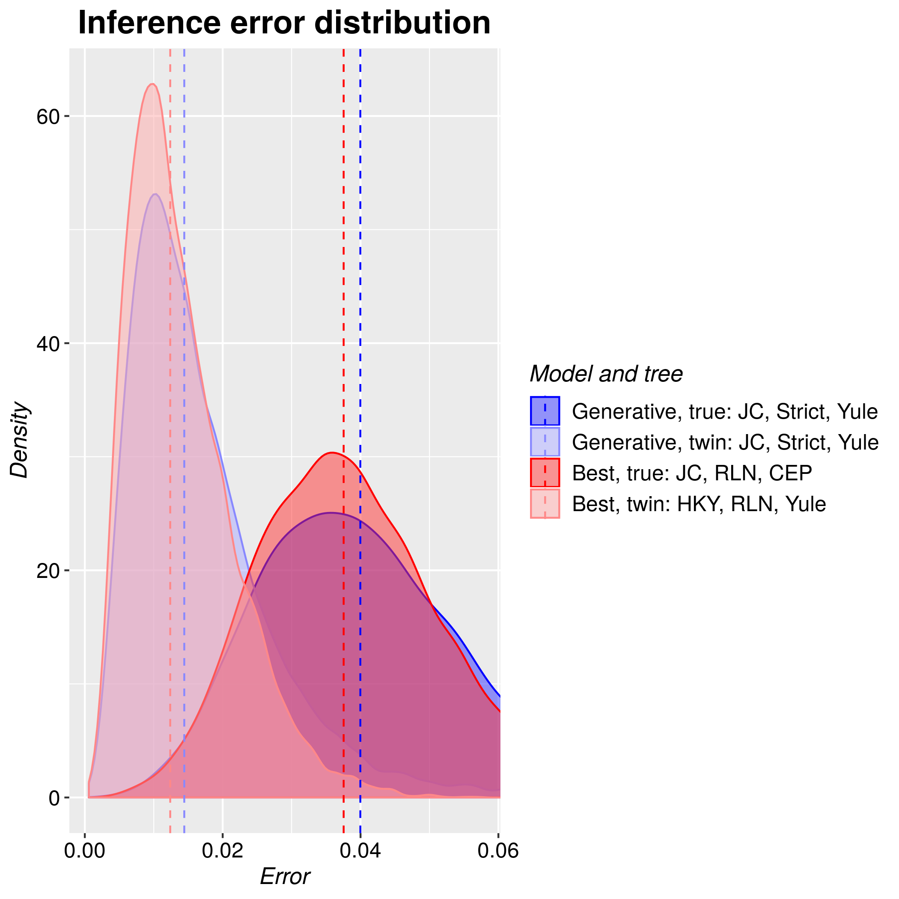

# pirouette

Branch|[](https://travis-ci.org)|[](https://www.appveyor.com)|[](https://www.codecov.io)
---|---|---|---
master|[](https://travis-ci.org/richelbilderbeek/pirouette)|[](https://ci.appveyor.com/project/richelbilderbeek/pirouette/branch/master)|[](https://codecov.io/github/richelbilderbeek/pirouette/branch/master)
develop|[](https://travis-ci.org/richelbilderbeek/pirouette)|[](https://ci.appveyor.com/project/richelbilderbeek/pirouette/branch/develop)|[](https://codecov.io/github/richelbilderbeek/pirouette/branch/master)
giovanni|[](https://travis-ci.org/richelbilderbeek/pirouette)|[](https://ci.appveyor.com/project/richelbilderbeek/pirouette/branch/giovanni)|[](https://codecov.io/github/richelbilderbeek/pirouette/branch/master)
richel|[](https://travis-ci.org/richelbilderbeek/pirouette)|[](https://ci.appveyor.com/project/richelbilderbeek/pirouette/branch/richel)|[](https://codecov.io/github/richelbilderbeek/pirouette/branch/master)


`pirouette` is an R package that estimates the error BEAST2 makes from a given 
phylogeny. This phylogeny can be created using any (non-BEAST) speciation model,
for example the Protracted Birth-Death or Multiple-Birth-Death models.

The heavy lifting is done by these packages:

 * [phangorn](https://github.com/KlausVigo/phangorn): to simulate an alignment from a phylogeny
 * [babette](https://github.com/ropensci/babette): to use an alignment to create a posterior

## Installation

`pirouette` can be installed

 * from script (easiest)
 * from R 

### From script

All the manual steps are put in the `install_pir_deps`
script, which is located in the `scripts` folder.

To call the script:

```
cd scripts
./install_pir_deps
```

### From R

Thanks to the `remotes` R package, this is easy:

```{r}
remotes::install_github("KlausVigo/phangorn")
remotes::install_github("ropensci/beautier")
remotes::install_github("ropensci/tracerer")
remotes::install_github("ropensci/beastier")
remotes::install_github("ropensci/mauricer")
remotes::install_github("ropensci/babette")
remotes::install_github("richelbilderbeek/mcbette")
remotes::install_github("richelbilderbeek/pirouette")
```

To install BEAST2, see [how to install BEAST2](https://github.com/ropensci/beastier/blob/master/install_beast2.md)
or use:

```{r}
beastier::install_beast2()
```

To install the BEAST2 `NS` package:

```{r}
mauricer::install_beast2_pkg("NS")
```

## [Examples](https://github.com/richelbilderbeek/pirouette_examples)

See [https://github.com/richelbilderbeek/pirouette_examples](https://github.com/richelbilderbeek/pirouette_examples)
for all [https://github.com/richelbilderbeek/pirouette](https://github.com/richelbilderbeek/pirouette)
examples.



## Interpretation

### Relevance of comparing error distributions

**Compare with** | **TB** | **WG** | **WB**
-----------------|--------|--------|--------
**TG**           |  Y     |  Y     |  N
**TB**           |  .     |  N     |  Y
**WG**           |  .     |  .     |  Y
**WB**           |  .     |  .     |  .


Legend:

 * TG: true tree, generative model
 * TB: true tree, best candidate model
 * WG: twin tree, generative model
 * WB: twin tree, best candidate model

### Inpretation of comparing relevant error distributions

**Condition** | **Expectation** |  **Interpretation**
--------------|-----------------|-------------------------------------------------------------------------------------------------------
**$TG > TB$** |  Unexpected     |  Novel tree prior is more related to best candidate than hand-picked tree prior
**$TG ≈ TB$** |   Possible      |  Hand-picked tree prior is just as suitable as the best candidate tree prior
**$TG < TB$** |   Expected      |  Hand-picked tree prior is the most related tree prior
**$TG > WG$** |    Unknown      |  Novel tree prior important
**$TG ≈ WG$** |    Unknown      |  Novel tree prior unimportant
**$TG < WG$** |  Unexpected     |  Twinning procedure increases inference errors when using hand-picked tree prior
**$TB > WB$** |   Expected      |  Impact of novel tree prior cannot be compensated for by model selection: twin tree with low likelihood?
**$TB ≈ WB$** |   Possible      |  Best candidate tree priors perform equally well in true and twin tree: true and twin tree similar?
**$TB < WB$** |  Unexpected     |  Twinning procedure increases inference errors when using best tree prior candidate
**$WG > WB$** |  Unexpected     |  Hand-picked tree prior (that equals the twinning tree prior!) worse than best candidate tree prior
**$WG ≈ WB$** |   Possible      |  Twin tree fits equally well to the hand-picked and best candidate tree prior
**$WG < WB$** |   Expected      |  Hand-pick tree prior (that equals the twinning tree prior) performs as expected

This interpretation assumes
that the operators ($<$, $\approx$ and $>$) to compare distributions
are defined. 

Legend:

 * TG: true tree, generative model
 * TB: true tree, best candidate model
 * WG: true tree, generative model
 * WB: true tree, best candidate model

## [FAQ](doc/faq.md)

See the [FAQ](doc/faq.md).

## There is a feature I miss

See [CONTRIBUTING](CONTRIBUTING.md), at `Submitting use cases`

## I want to collaborate

See [CONTRIBUTING](CONTRIBUTING.md), at 'Submitting code'

## I think I have found a bug

See [CONTRIBUTING](CONTRIBUTING.md), at 'Submitting bugs' 

## There's something else I want to say

Sure, just add an Issue. Or send an email.

## Package dependencies

Package                                          |[](https://travis-ci.org)                                                          |[](https://www.codecov.io)
-------------------------------------------------|-----------------------------------------------------------------------------------------------------------------------|----------------------------------------------------------------------------------------------------------------------------------------------------
[beautier](https://github.com/ropensci/beautier) |[](https://travis-ci.org/ropensci/beautier)  |[](https://codecov.io/github/ropensci/beautier/branch/master)
[beastier](https://github.com/ropensci/beastier) |[](https://travis-ci.org/ropensci/beastier)  |[](https://codecov.io/github/ropensci/beastier/branch/master)
[mauricer](https://github.com/ropensci/mauricer) |[](https://travis-ci.org/ropensci/mauricer)  |[](https://codecov.io/github/ropensci/mauricer/branch/master)
[mcbette](https://github.com/ropensci/mcbette)   |[](https://travis-ci.org/ropensci/mcbette)    |[](https://codecov.io/github/ropensci/mcbette/branch/master)
[tracerer](https://github.com/ropensci/tracerer) |[](https://travis-ci.org/ropensci/tracerer)  |[](https://codecov.io/github/ropensci/tracerer/branch/master)

### Windows

Package                                                                       | Status
------------------------------------------------------------------------------|------------------------------------------------------------------------------------------------------------------------------------------------------------------------------------------
[babette_on_windows](https://github.com/richelbilderbeek/babette_on_windows)  |[](https://ci.appveyor.com/project/richelbilderbeek/babette-on-windows/branch/master)
[beastier_on_windows](https://github.com/richelbilderbeek/beastier_on_windows)|[](https://ci.appveyor.com/project/richelbilderbeek/beastier-on-windows/branch/master)
[beautier_on_windows](https://github.com/richelbilderbeek/beautier_on_windows)|[](https://ci.appveyor.com/project/richelbilderbeek/beautier-on-windows/branch/master)
[mauricer_on_windows](https://github.com/richelbilderbeek/mauricer_on_windows)|[](https://ci.appveyor.com/project/richelbilderbeek/mauricer-on-windows/branch/master)
[tracerer_on_windows](https://github.com/richelbilderbeek/tracerer_on_windows)|[](https://ci.appveyor.com/project/richelbilderbeek/tracerer-on-windows/branch/master)

## External links

 * [BEAST2 GitHub](https://github.com/CompEvol/beast2)
