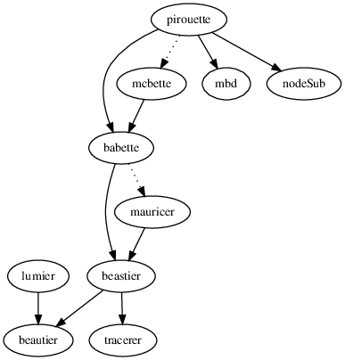

# FAQ

## Package

## Could you show some [examples](https://github.com/richelbilderbeek/pirouette_examples)?

See [https://github.com/richelbilderbeek/pirouette_examples](https://github.com/richelbilderbeek/pirouette_examples)
for all [https://github.com/richelbilderbeek/pirouette](https://github.com/richelbilderbeek/pirouette)
examples.

### What are the dependencies?

`pirouette` depends on (non-CRAN) packages like this:



### [How to set up the experiments](how_to_set_up_experiments.md)?

See [How to set up the experiments](how_to_set_up_experiments.md)

### Where are the files stored?

`pirouette` creates a lot of files, that are by default stored
in a `temp` folder. Here are their locations:

File                               |Where
-----------------------------------|-----------------------------------------------------------------------
The (true) phylogeny               |Unsaved, as the user supplies it
The (true) alignment               |`pir_params$alignment_params$fasta_filename`
The true evidence                  |`pir_params$evidence_filename`
The twin phylogeny                 |`pir_params$twinning_params$twin_tree_filename`
The twin alignment                 |`pir_params$twinning_params$twin_alignment_filename`
The twin evidence                  |`pir_params$twinning_params$twin_evidence_filename`
BEAST2 (`.xml`) input file (1)     |pir_params$experiments[[1]]$beast2_options$beast2_input_filename
BEAST2 `.log` output file (1)      |pir_params$experiments[[1]]$beast2_options$beast2_output_log_filename
BEAST2 `.trees` output file (1)    |pir_params$experiments[[1]]$beast2_options$beast2_output_trees_filename
BEAST2 `.xml.state` output file (1)|pir_params$experiments[[1]]$beast2_options$beast2_output_state_filename

 * (1) of the first experiment

### Where are the pictures of `pir_to_pics` stored?

`pir_to_pics` needs a true tree and `pir_params` 
to store it in any folder.

File                               |Where
-----------------------------------|-----------------------------------------------------------------------
The (true) phylogeny               |`true_tree.png`
The (true) alignment               |`true_alignment.png`
The true evidence                  |None
The twin phylogeny                 |`twin_tree.png`
The twin alignment                 |`twin_alignment.png`
The twin evidence                  |None
BEAST2 (`.xml`) input file         |None
BEAST2 `.log` output file          |None
BEAST2 `.trees` output file        |`true_posterior_gen.png`
BEAST2 `.trees` output file        |`true_posterior_best.png`
BEAST2 `.trees` output file        |`twin_posterior_gen.png`
BEAST2 `.trees` output file        |`twin_posterior_best.png`
BEAST2 `.xml.state` output file    |None
Errors                             |`true_error_histogram_gen.png`
Errors                             |`true_error_histogram_best.png`
Errors                             |`twin_error_histogram_gen.png`
Errors                             |`twin_error_histogram_best.png`
Errors                             |`true_error_violin_gen.png`
Errors                             |`true_error_violin_best.png`
Errors                             |`twin_error_violin_gen.png`
Errors                             |`twin_error_violin_best.png`

### Why the name?

`pirouette` started out as a working title, as it is an elegant
combination of `phylogeny` and `babette`. Other name contenders 
were `phyrouette`, `palette` and many more...

The name stuck.

### Why is the code coverage less than 100%?

Because too much needs to be done in one hour.

Also, `pirouette` lacks mocks. 

## BEAST2

### How to install BEAST2?

See [how to install BEAST2](https://github.com/ropensci/beastier/blob/master/doc/install.md#install-beast2),
or use

```{r}
beastier::install_beast2()
```

## Development and community

### How can I indicate a feature that I miss?

Submit an Issue.

### How can I submit code?

See [CONTRIBUTING](../CONTRIBUTING.md), at 'Submitting code'

### How can I submit a bug?

See [CONTRIBUTING](../CONTRIBUTING.md), at 'Submitting bugs' 

### How can I indicate something else?

Submit an Issue. Or send an email to Richel Bilderbeek.

### How to create the dependency graph from the `.dot` file?

```
dot -Tps dependencies.dot -o dependencies.ps; convert dependencies.ps dependencies.png
```

